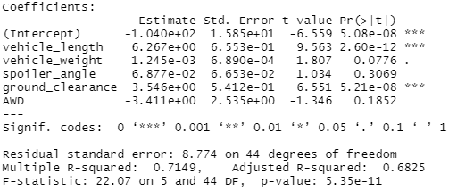
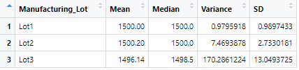

# MechaCar_Statistical_Analysis

# Deliverable 1
## Linear Regression to Predict MPG

## 1. Which variables/coefficients provided a non-random amount of variance to the mpg values in the dataset?
In this model, we included all five available variables to measure their impact on the mpg of MechaCars vehicles. Using a multiple linear regression model, three variables as well as the y-intercept returned significant p-values below the 0.05 cut-off. Vehichle length, vehicle weight, and ground clearance contribute to mpg of these vehicles and this impact is non-random (p<0.05). The significance of the intercept is <0.05 indicating that other variables influence mpg that the intercept accounts for, in part. 

## 2. Is the slope of the linear model considered to be zero? 
The p-value for the slope is 5.08 x 10-8 which is significantly less than our assumed significance p-value (p=0.05). As such, we reject the null hypothesis that the slope of our linear model is zero. 

## Does this linear model predict mpg of MechaCar prototypes effectively?
This linear model effectively (but not completely) predicts mpg of MechaCar prototypes based on an r-square of 0.7 and an overall p-value for the model of 5.35 x 10-11 (p<.05). An r-square approaching 1.0 indicates that the model more completely predicts the outcome (mpg, in this case). Given our r-squared of 0.7 and not 0.99, there are clearly additional factors that predict mpg.

# Deliverable 2
## Summary Statistics on Suspension Coils
A manufacturing standard for MechaCars is that variance is minimized between vehicle suspension coils. Variance must not exceed 100 pounds per square inch. We decided to look at summary statistics data to look at variance in MechaCars.

Overall, summary data shows that the mean and median for suspension coil PSI are nearly equivalent (1499 vs 1500, respectively). The variance is below the threshhold of 100 at 62 PSI and the standard deviation appears reasonable at 7.9 PSI. 

To confirm there is not variance between vehicle suspension coils at our manufacturing lots, we decide to look at summary statistics across our Manufacturing lots. Here, we see that while the mean and median are comparable across lots, the variance is much higher and above the 100 PSI threshold at Lot 3. 

# Deliverable 3
## T-Tests on Suspension Coils
In the car manufacturing industry, the pounds per square inch (PSI) standard is 1,500 per square inch for suspension coils. This standard is also known as the population mean. We need to understand if MechaCars suspension coils vary from this population mean. To do this, we will perform a one-sample t-test to test whether MechaCars suspension coil mean is the same as the population mean (null hypothesis).

Looking at suspension coils across all manufacturing lots, our t-test comparing our sample mean to the population mean results in no signficiant difference (p=0.06). What is notable here is that the p-value is approaching 0.05 and does make us wonder if something is awry in our manufacturing. We'd like to see something much further away from the p-value level. In this case, we do not want to reject the null hypothesis.

We investigate further and look at suspension coil PSI across manufacturing lots. This requires subsetting our group data and running t-tests on each lot. It's worth the effort. Lot 1 (p=1) and Lot 2 (p=0.6) produce p-values that are not stastistically significant - we feel better about manufacturing of suspension coils at these lots. There isn't a signficant difference in PSIs at these lots compared to the industry standard. Lot 3, on the otherhand, has a p-value=0.04. This is statistically signficant and we see that the PSI for suspension coils is significantly different at the 0.05 level at Lot 3 compared to the industry standard.

# Deliverable 4
## Study Design: MechaCar vs. Competition
For this study, we want to understand if there's a relationship between car safety ratings and vehicle performance. We'll assume that cars receive a safety rating on a scale of 1-100 and that it is widely available. For vehicle performance, we will look at widely available data including horsepower, city and highway mpg, vehicle weight, vehicle length, and cost by vehicle. We want to know if these variables contribute to the safety rating and how significant each variable is to the model. Perhaps there are better/more relevant variables that would be better to include but we will start with these easily found metrics.

The null hypothesis is that by manufacturer and vehicle type, there is no difference in safety ratings when looking at various vehicle metrics including horsepower, city and highway mpg, vehicle weight and length, and cost.

The alternative hypothesis is that safety ratings variance is due to factors including horsepower, city and highway mpg, vehicle weight and length, and cost.

The statistical test for this will be a multiple regression analysis with a p-value of 0.05 to test for significance of the overall model and for each metric. 
The data to be used for this analysis includes publically available vehicle data with the metrics noted for vehicles available to purchase in the U.S. as well as our MechaCar data used for this Challenge. 

